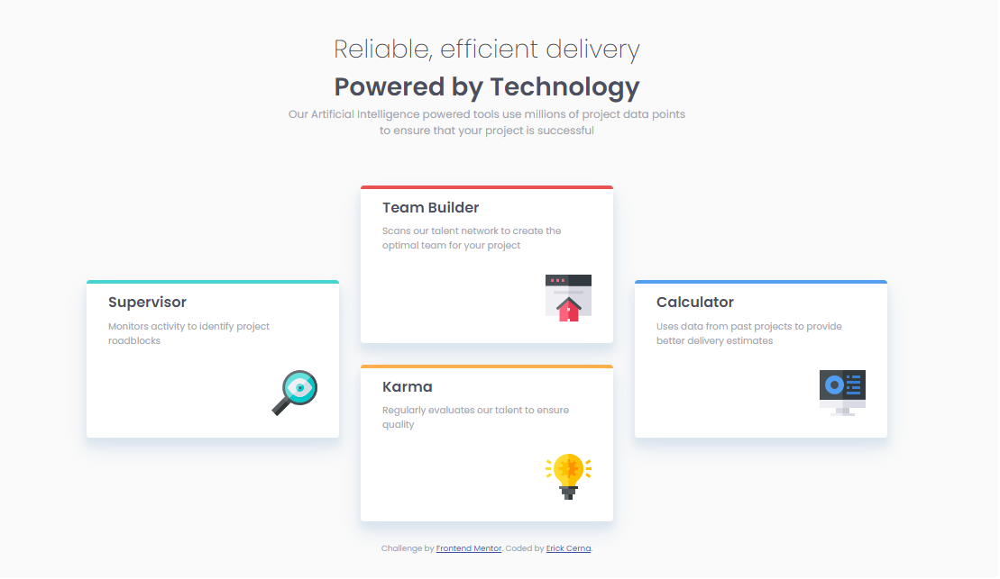

# Frontend Mentor - Four card feature section solution

This is a solution to the [Four card feature section challenge on Frontend Mentor](https://www.frontendmentor.io/challenges/four-card-feature-section-weK1eFYK). Frontend Mentor challenges help you improve your coding skills by building realistic projects. 

## Table of contents

- [Overview](#overview)
  - [The challenge](#the-challenge)
  - [Screenshot](#screenshot)
  - [Links](#links)
- [My process](#my-process)
  - [Built with](#built-with)
  - [What I learned](#what-i-learned)
  - [Continued development](#continued-development)
  - [Useful resources](#useful-resources)
- [Author](#author)


## Overview

Hi everyone, I made this project to practice CSS.


### The challenge

Users should be able to:

- View the optimal layout for the site depending on their device's screen size

### Screenshot



This is a screenshot of the desktop layout


### Links

- Solution URL: [Add solution URL here](https://four-card-feature-srna.netlify.app/)


## My process

To develop this project use HTML, CSS, Flexbox.


### Built with

- Semantic HTML5 markup
- CSS custom properties
- Flexbox


### What I learned

I learned how to position different divs in rows and columns.


```html
<main>
    <div class="item supervisor">
      <h2>Supervisor</h2>
      <p>Monitors activity to identify project roadblocks</p>
      
    </div>

    <div class="center">
      <div class="item teambuilder">
        <h2>Team Builder</h2>
        <p>Scans our talent network to create the optimal team for your project</p>
        
      </div>
  
      <div class="item karma">
        <h2>Karma</h2>
        <p>Regularly evaluates our talent to ensure quality</p>
        
      </div>
    </div>

    <div class="item calculator">
      <h2>Calculator</h2>
      <p>Uses data from past projects to provide better delivery estimates</p>
      
    </div>

  </main>
```
```css
main{
    margin: 0 auto;
    max-width: 1170px;
    display: flex;
    flex-wrap: wrap;
    justify-content: center;
    align-items: center;
}


.item{
    background-color: #fff;
    box-shadow: 0 15px 28px rgba(218, 228, 238, 0.8),
    0 10px 10px rgba(218, 228, 238, 0.9);
    border-radius: 5px;
    padding: 10px 30px 30px;
    width: 350px;
    margin: 15px;
    
}
```


### Continued development

I want to continue improving my knowledge in Flexbox and learn more about CSS Grid, I plan to develop this project using CSS Grid


### Useful resources

- [Example resource 1](https://css-tricks.com/snippets/css/a-guide-to-flexbox/) - This helped me for Flexbox. 

## Author

- Website - [Erick Cerna](https://erick-cerna.netlify.app/)
- Frontend Mentor - [@erickcerna](https://www.frontendmentor.io/profile/erickcerna)
- Twitter - [@tavo_rasta](https://www.twitter.com/tavo_rasta)


